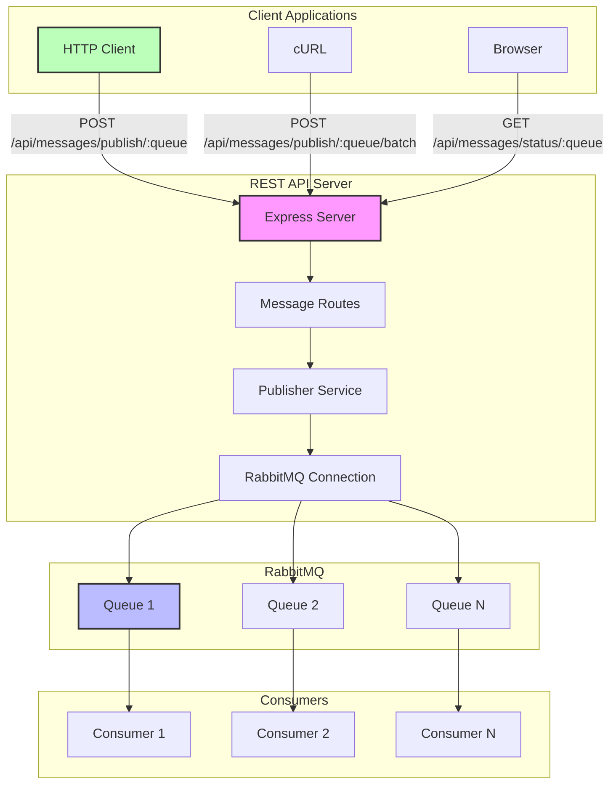

# RabbitMQ System Architecture

## Flow Description

1. **Client Request Flow:**
   - Clients send HTTP requests to REST API endpoints
   - Express server routes requests to appropriate handlers
   - Publisher service formats messages
   - Messages are sent to RabbitMQ

2. **Message Flow:**
   - Messages enter RabbitMQ queues
   - Consumers process messages from queues
   - Acknowledgments are sent back

3. **Monitoring Flow:**
   - Clients can check queue status
   - RabbitMQ Management UI shows real-time stats
   - Consumers report processing status
